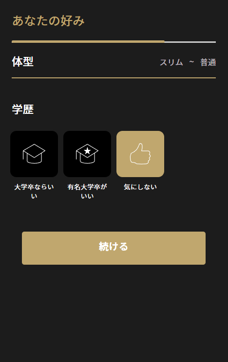

# Xvolve Flow
## 1) Login
- At login page: **/login**

- After pressing ログイン redirect to: **/sms-login**

- Enter phone number (must start with 0 and has 10 digits) and direct to: **/sms-verification-code**

- After submit:
    - If account exist, direct to: **/participation**

    
    
    - If account don't exist, direct to: **/registration-form**: in which inludes gender, date of birth, date area, email and invitation code

    

## 2) 1st registration form
- Step 1: Enter the info above and direct to step 1: Includes preferred facial features (must select at least 3) **/registration-form/step-1**

- Step 1.5: After step 1, direct to step 1.5, where you can choose your favourite personality types, choose in numerical order **/registration-form/step-1.5**

- Step 2: After that, direct to step 2 which contains preferred profession, age group and height range **/registration-form/step-2**

- Step 3: When direct to step 3 you can choose your preferred body type and education **/registration-form/step-3**

- Step 4: In this step, choose your preferred alcohol level and marriage history **/registration-form/step-4**

- Step 5: This step only appear for **female** users, in which you can choose your partner tobacco usage and yearly salary **/registration-form/step-5**

- Step 6: After a cool loading screen, is a form uses to enter your info includes real name, profession, yearly salary, graduation and school name or specialty (graduation field, school name field only appear when salary is set to 300万円~400万円 and specialty field only appear when graduation is set to 短大/専門学校卒) **/registration-form/step-6**

- Step 7: Finally is a screen to set your profile picture. When setting the pic you will be prompt of invalid picture cases. **/registration-form/step-7**

> After finishing you will be directed to participation screen **/participation**

> When registering if you encounter some bugs that prevent you from going to further steps, change regis_step in the database!

